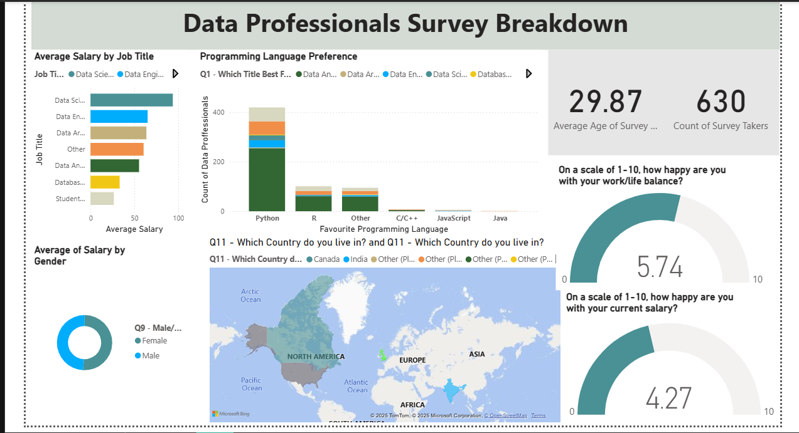
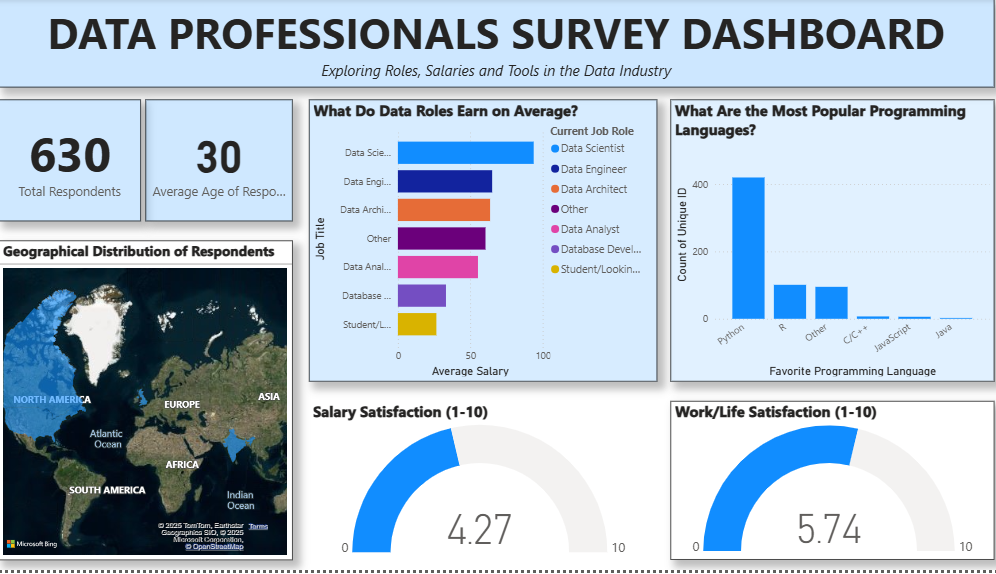

# 📊 Data Professionals Survey Dashboard

This Power BI dashboard analyzes responses from a global survey of data professionals.  
It explores trends in job roles, salaries, programming languages, work-life balance, and satisfaction levels in the data industry.

---

## 📌 Project Overview
The **Data Professionals Survey Dashboard** provides an interactive view into the world of data professionals.  
It allows users to:
- Compare **average salaries** by job title
- See the **geographic distribution** of respondents
- Discover **favorite programming languages**
- Analyze **average satisfaction ratings** for salary 
---

## 📊 Dashboards Preview

### Design 1

### Design 2

---

## 🛠 Tools & Technologies
- **Power BI Desktop** – Data modeling & visualization
- **DAX** – Calculations for KPIs
- **Git & GitHub** – Version control & project hosting

---

## 📈 Key Insights
- **Highest Paying Roles**: Data Scientist & Data Engineer lead in average salaries.
- **Most Popular Programming Language**: Python dominates, followed by SQL.
- **Top Respondent Countries**: USA, India, and UK are most represented.
- **Average Ratings** *(Scale: 1–10)*:
  - Salary Satisfaction: **4.27**
  - Work-Life Balance: **5.74**
  

---

## 📂 Dataset
The dataset was obtained from  **Alex The Analyst** (Github), based on a survey of data professionals.

If you wish to replicate this dashboard:
- Download the `.pbix` file
- Open with **[Power BI Desktop](https://powerbi.microsoft.com/desktop/)**

---

## ✨ Author
Emmanuella Osuala
    LinkedIn
     GitHub
